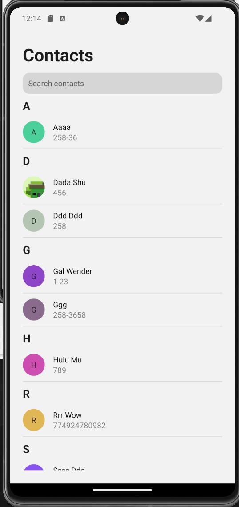

# React Native Contacts List App


This is a Contacts list app where users can preview their list of contacts, filter by search, and preview the details of each contact.

## Installation

1. Clone the repository:

    ```bash
    git clone <repository-url>
    ```

2. Install dependencies:

    ```bash
    npm install
    ```

3. Run the project:

    ```bash
    npm start
    ```

4. Follow the instructions to open the app in the Expo Go app on your mobile device or an emulator.

## Screenshots




